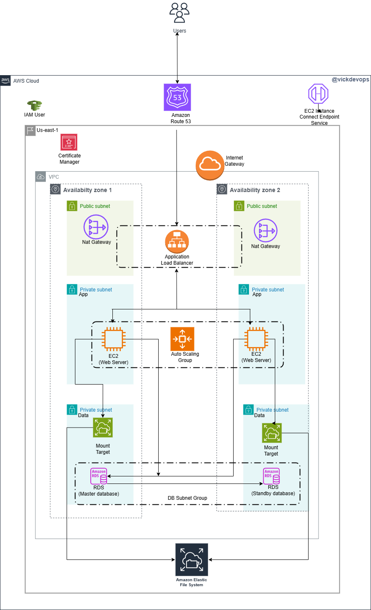

# WordPress Deployment on AWS


## Project Overview
This project demonstrates the deployment of a WordPress website on Amazon Web Services (AWS) using a robust and scalable architecture. The deployment leverages various AWS services to ensure high availability, security, and scalability.

## Architecture Overview

The deployment architecture includes the following components:

1. **Virtual Private Cloud (VPC):** Configured with both public and private subnets across two different availability zones to ensure high availability and fault tolerance.

2. **Internet Gateway:** Deployed to facilitate connectivity between VPC instances and the wider Internet.

3. **Security Groups:** Established as a network firewall mechanism to control inbound and outbound traffic to AWS resources.

4. **Public Subnets:** Utilized for infrastructure components like the NAT Gateway and Application Load Balancer.

5. **Private Subnets:** Web servers (EC2 instances) are positioned within private subnets for enhanced security.

6. **NAT Gateway:** Enabled instances in private subnets to access the Internet securely.

7. **EC2 Instances:** Hosted the WordPress website, with an Auto Scaling Group managing the instances to ensure availability and scalability.

8. **Application Load Balancer (ALB):** Employed to evenly distribute web traffic to EC2 instances across multiple availability zones.

9. **Elastic File System (EFS):** Used as a shared file system to store WordPress files, allowing multiple EC2 instances to access the same data.

10. **Relational Database Service (RDS):** Utilized for the WordPress database to provide scalable and managed database services.

11. **AWS Certificate Manager:** Secured application communications by managing SSL/TLS certificates.

12. **Route 53:** Registered the domain name and set up DNS records for the website.

13. **Simple Notification Service (SNS):** Configured to send alerts about activities within the Auto Scaling Group.

## Deployment Steps

### 1. Clone the Repository

Clone the GitHub repository containing the deployment scripts and reference diagram:

```bash
git clone https://github.com/your-repository/wordpress-aws-deployment.git
```

### 2. Configure AWS CLI

Ensure that the AWS Command Line Interface (CLI) is installed and configured with the necessary permissions:

```bash
aws configure
```

### 3. Deploy CloudFormation Templates

Navigate to the `cloudformation` directory and deploy the CloudFormation templates in the following order:

```bash
cd wordpress-aws-deployment/cloudformation

# Deploy the network stack
aws cloudformation create-stack --stack-name wordpress-network --template-body file://network.yaml --parameters file://network-parameters.json

# Deploy the security stack
aws cloudformation create-stack --stack-name wordpress-security --template-body file://security.yaml --parameters file://security-parameters.json

# Deploy the database stack
aws cloudformation create-stack --stack-name wordpress-database --template-body file://database.yaml --parameters file://database-parameters.json

# Deploy the application stack
aws cloudformation create-stack --stack-name wordpress-application --template-body file://application.yaml --parameters file://application-parameters.json
```

### 4. Access the WordPress Website

After the stacks are successfully deployed, obtain the DNS name of the Application Load Balancer from the AWS Management Console or by describing the stack outputs:

```bash
aws cloudformation describe-stacks --stack-name wordpress-application --query "Stacks[0].Outputs[?OutputKey=='ALBDNSName'].OutputValue" --output text
```

Navigate to the obtained DNS name in a web browser to access the WordPress website.

## Scripts

The repository includes scripts for installing WordPress on EC2 instances and configuring the environment. Below is an example of the WordPress installation script:

```bash
#!/bin/bash
# Update the software packages on the EC2 instance
sudo yum update -y

# Install Apache web server
sudo yum install -y httpd
sudo systemctl enable httpd
sudo systemctl start httpd

# Install PHP and necessary extensions
sudo amazon-linux-extras install -y php8.0
sudo yum install -y php-cli php-cgi php-curl php-mbstring php-gd php-mysqlnd php-gettext php-json php-xml php-fpm php-intl php-zip php-bcmath php-ctype php-fileinfo php-openssl php-pdo php-tokenizer

# Install MySQL client
sudo yum install -y mysql

# Set up EFS mount point
EFS_DNS_NAME=fs-xxxxxxxx.efs.us-east-1.amazonaws.com
sudo mkdir -p /var/www/html
sudo mount -t nfs4 -o nfsvers=4.1 "$EFS_DNS_NAME":/ /var/www/html

# Set permissions
sudo chown -R ec2-user:apache /var/www
sudo chmod 2775 /var/www && find /var/www -type d -exec sudo chmod 2775 {} \;
sudo find /var/www -type f -exec sudo chmod 0664 {} \;

# Download and set up WordPress
wget https://wordpress.org/latest.tar.gz
tar -xzf latest.tar.gz
sudo cp -r wordpress/* /var/www/html/
sudo cp /var/www/html/wp-config-sample.php /var/www/html/wp-config.php

# Restart Apache
sudo systemctl restart httpd
```

## Reference Diagram

The architecture diagram illustrating the deployment setup is available in the repository under the `diagrams` directory.

## License

This project is licensed under the MIT License. See the `LICENSE` file for details.

## Acknowledgments

This deployment follows best practices as outlined in the [Best Practices for WordPress on AWS](https://docs.aws.amazon.com/whitepapers/latest/best-practices-wordpress/reference-architecture.html) whitepaper.

For more detailed information and additional resources, refer to the [aws-samples/aws-refarch-wordpress](https://github.com/aws-samples/aws-refarch-wordpress) repository.

## Conclusion

By following this guide, you can deploy a scalable, secure, and highly available WordPress website on AWS, leveraging various AWS services to ensure optimal performance and reliability.

For a visual demonstration of deploying WordPress using CloudFormation, you may find the following video helpful:

 
